# 项目链接

视频在这里，强烈建议先看视频！  
https://www.bilibili.com/video/bv1BK411G7cn  

源码在这里  
https://gitee.com/dma/iot_led.git  

电路图及PCB在这里  
https://oshwhub.com/Code504/e53-kuo-zhan-mu-kuai_copy  


# 背景介绍

几年前我在某次活动中以很低的价格买到了一些质量很不错的LED灯条，刚买到这些灯条我都是直接焊好电路，找个地方随便用胶带一粘就凑合用了，非常简单粗暴。外观什么的我好像从来就没考虑过，后来实在看不下去了就准备进行改造。

自学CAD，简单画一个外壳，当然中间改版过多次，失败的就不看了，这是最终定稿
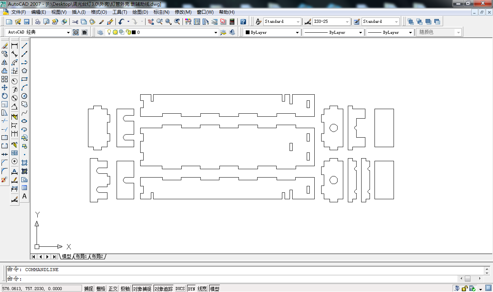  

在国内某知名电商网站上找激光切割，这是收到的成品，本着节约的原则，一整块椴木板上切了很多款外壳
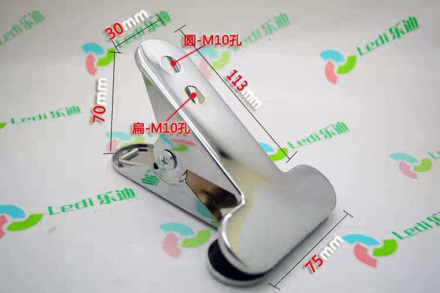  

取出一套外壳的所有零件，当然其中有一些是多余的备用件
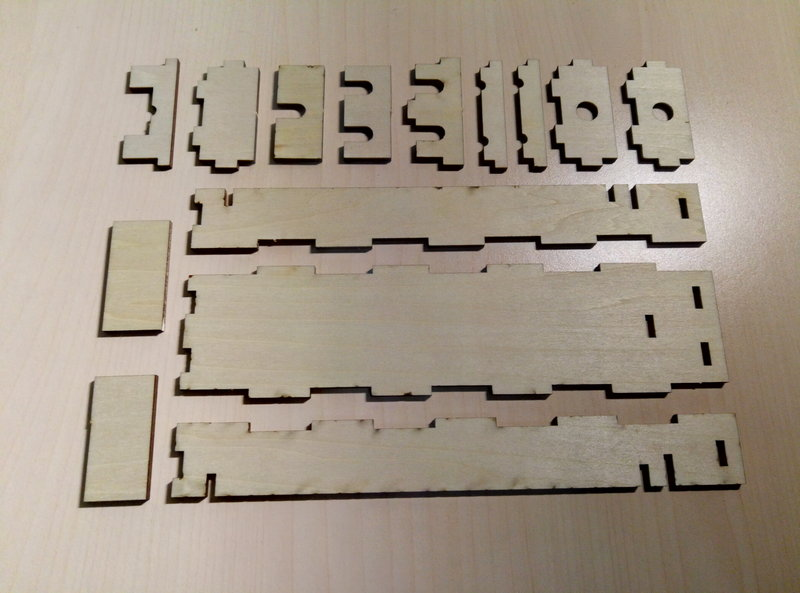  

焊接双色LED灯管（同款搜索“Rohm led灯条”），每个灯管的黄色与黄色并联，白色与白色并联
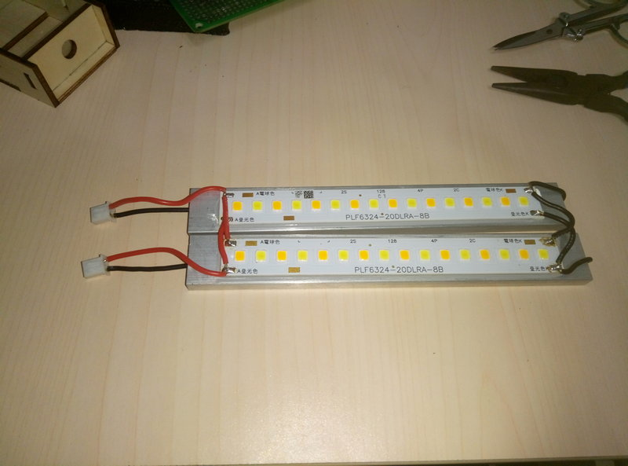  

先把外壳用胶水粘起来，然后放入灯管，再用小的这几块固定灯管，这个过程很难用文字描述，总之装起来长这样  
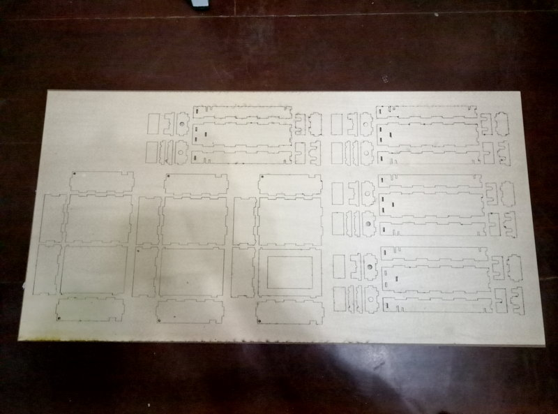  

这是做的第一版控制电路，主控是一颗STC15W4k48S4单片机，后面有一些电容电阻等外围元件  
  

背面是一个旋转编码器，类似鼠标滚轮，有刻度感可以按  
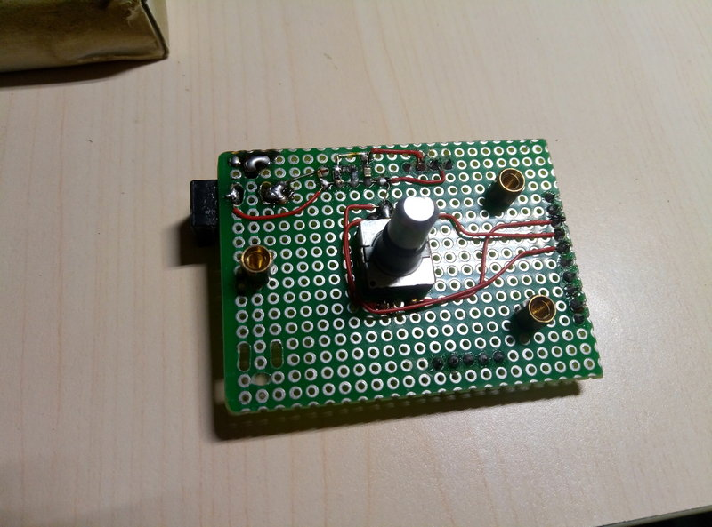  

LED驱动采用是PT4115，这里用覆铜板手工刻一个电路  
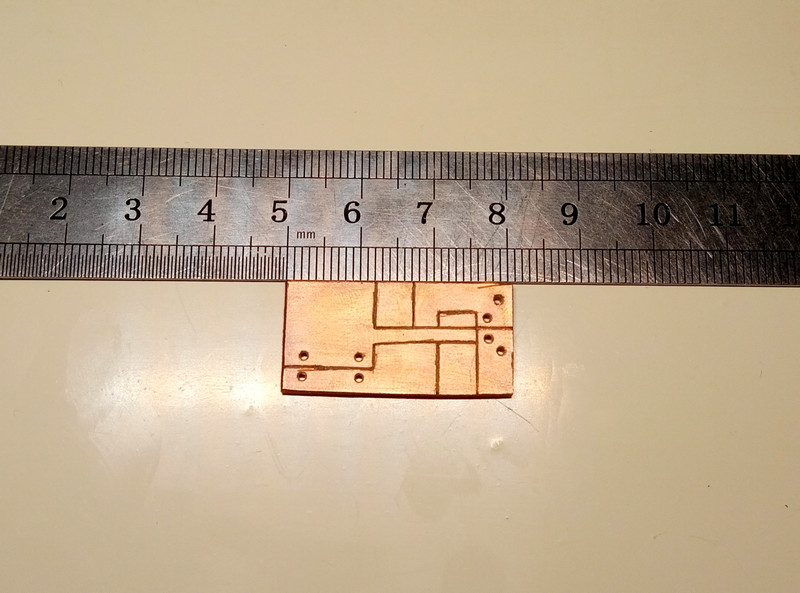  

焊接完以后是这样的  
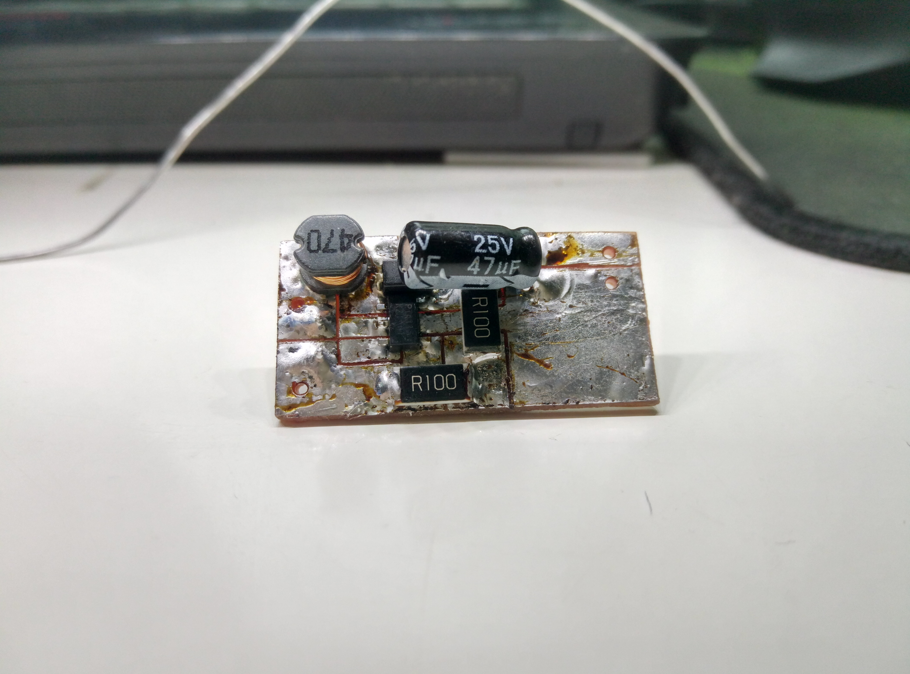  

最后把主控和LED驱动焊接起来
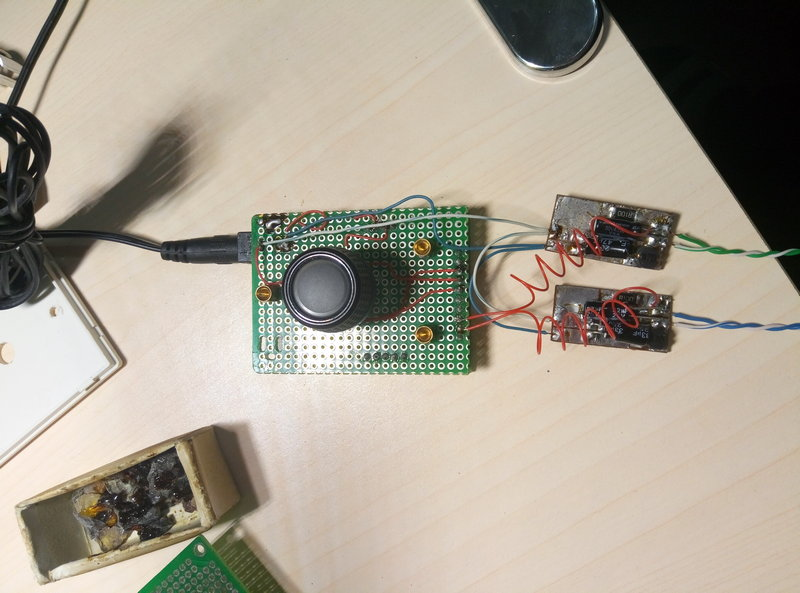  

同样是在国内某知名电商网站上买的一些塑料外壳，量一下需要开孔的位置然后手动钻孔
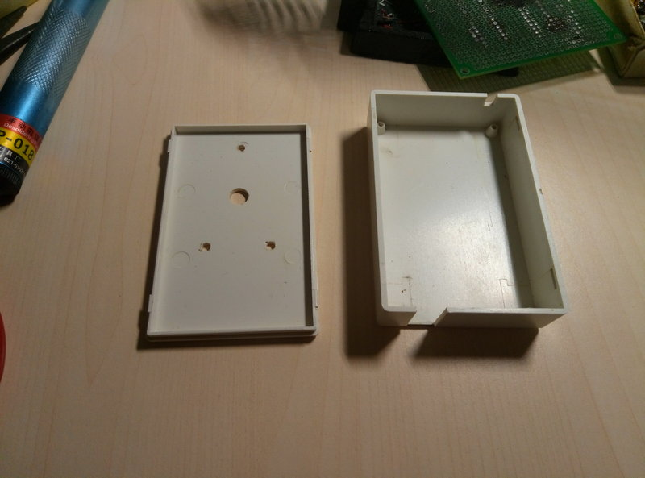  

整体组装过程没有拍照，鹅颈管和夹子也是在国内某知名电商网站上买的，记得焊接前把螺丝和线都从鹅颈管内穿好，我这里返工了两次，一次是忘了螺丝，另一次是忘了接头，组装好以后是这样的，我用一些包装上拆出来的磨砂塑料壳裁了一块合适大小放在灯管上，这样光线会柔和一点，不至于太刺眼  
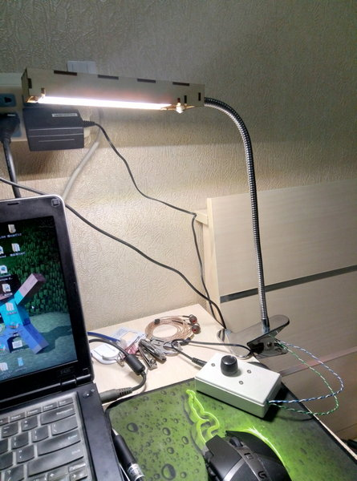  

上面就是我大概两、三年前做的台灯，可以调整亮度和色温，一直在用。大概一年前又进行了一次升级，优化电路并减小体积，留了ESP8266焊盘，准备接入物联网  
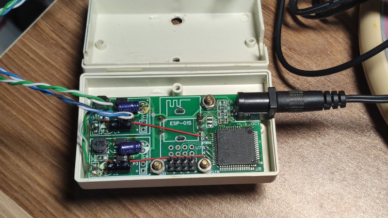  

其实我原本打算接入小米物联网，因为小爱同学用起来真的太方便了，既然这次有活动那就接入腾讯云好了，虽然不能用语音控制，微信小程序用起来也不差  

最终成品电路部分长这样，上面绿色的板子是我自己画的E53接口LED驱动模块，下面黑色的板子是TencentOS_tiny_EVB_G0开发板  
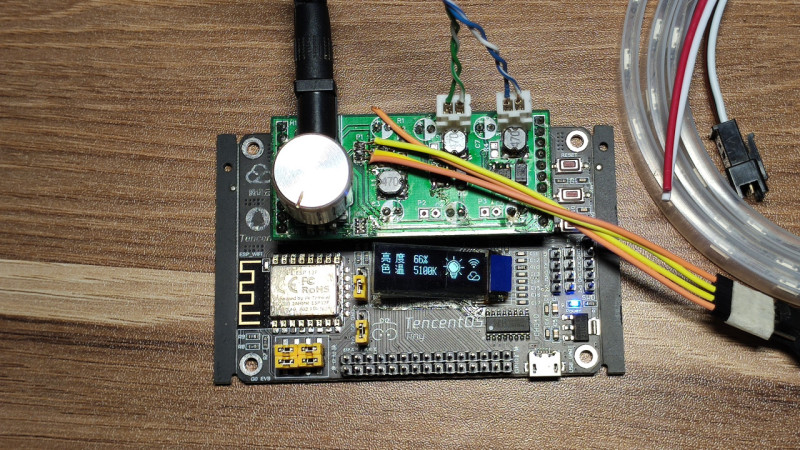  

完整的台灯长这样，还外接了一个1米长的WS2812灯带  
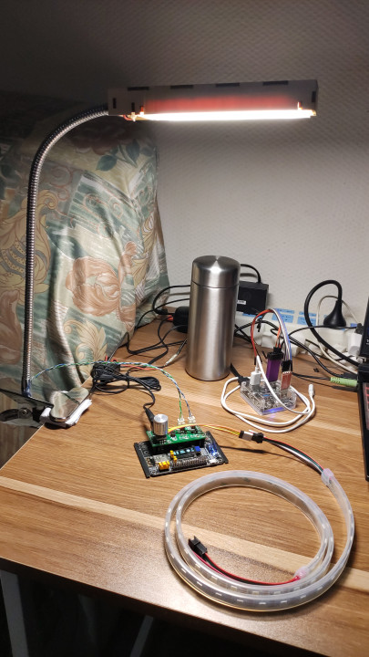  

# E53接口LED驱动模块使用方法
模块焊接完成如图  
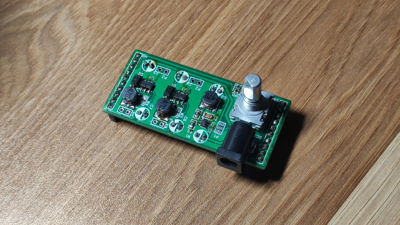  
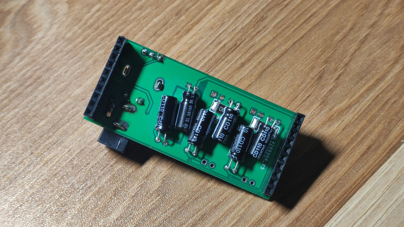  

1. 按照提供的资料焊接好所有电子元件，板子上预留WS2812灯带的接口，没有灯带可以不焊。  
2. 板子上有两路PT4115驱动，如果使用双色灯管，左边一路接黄色，右边一路接白色。如果使用单色灯管，建议只接右边一路，并把色温调整到6500K，这样使用的缺点就是浪费了一路驱动，想要驱动两路白光LED，请自行修改的代码，删除调整色温的相关内容。  
3. 灯管的功率计额定电压决定了PT4115的采样电阻，我现在用的是两根双色温灯管，单根灯管额定电压6V，单色额定电流300mA，我这里是两根灯管的黄色与黄色并联、白色与白色并联，单色温的总额定电流为600mA，根据PT4115手册计算出0.2ohm采样电阻输出电流为500mA，因此串联两个0.1ohm的采样电阻。如果使用其他规格的灯管请自行计算采样电阻阻值。
4. 旋转编码器旁边有一个排阻，为IO口上拉，如果单片机支持上拉可以不焊。
5. P2、P3、R3、R4为预留测试焊盘，不需要焊接
6. 我设计的输入电压为12V，如需驱动更高电压、更大功率的LED灯管，请注意元件耐压，可能需要更换更高耐压的元件。


# 代码使用方法

下载TencentOS代码 https://github.com/Tencent/TencentOS-tiny.git  

下载本工程代码 https://gitee.com/dma/iot_led.git  

把本工程代码放在 `TencentOS-tiny\board\TencentOS_tiny_EVB_G0\KEIL`下  

本工程使用的是AT SDK，已经集成在工程下，因为部分功能的需要，我在官方SDK的基础上做了一些修改及适配，源码在这里 https://github.com/tencentyun/qcloud-iot-sdk-tencent-at-based  

如需移植其他OS或开发板请参阅官方文档自行修改。  

下载ESP8266腾讯定制AT固件 https://github.com/tencentyun/qcloud-iot-esp-wifi.git  

解压 `/qcloud-iot-at-esp8266/QCloud_IoT_AT_ESP8266_FW/QCloud_IoT_AT_ESP8266_v2.1.1_20200903.zip`，选择QCloud_IoT_AT_ESP8266_v2.1.1_20200903_UART_1_3.bin文件并烧录。  

不同开发板及ESP8266设置跳线的方法不同，请参见开发板的说明以及ESP官方烧录说明。  

烧录工具下载地址 https://www.espressif.com/sites/default/files/tools/flash_download_tool_v3.8.5_1.zip  

有关烧录工具的星系使用方法参见工具内的说明文档 `flash_download_tool_v3.8.5\doc\Flash_Download_Tool__cn.pdf`  

在腾讯物联网开发平台创建设备，具体步骤参见 https://cloud.tencent.com/document/product/1081/34738  

产品定义，新建项目，新建产品，按如下配置  
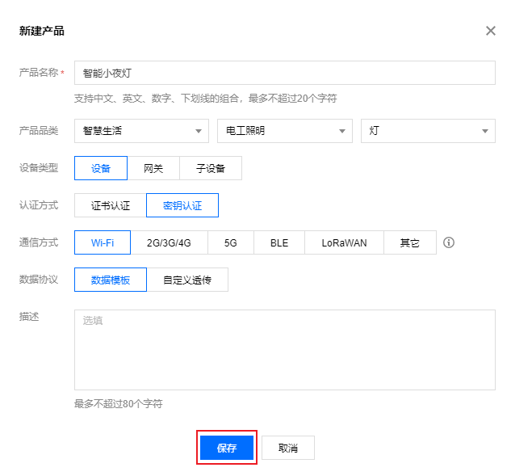  

数据模板，选择“导入json”，懒得折腾可以直接用我的json文件 `iot_led\user_code\智能灯.json`，你也可以添加自己的功能，或在我的基础上进行二次开发  
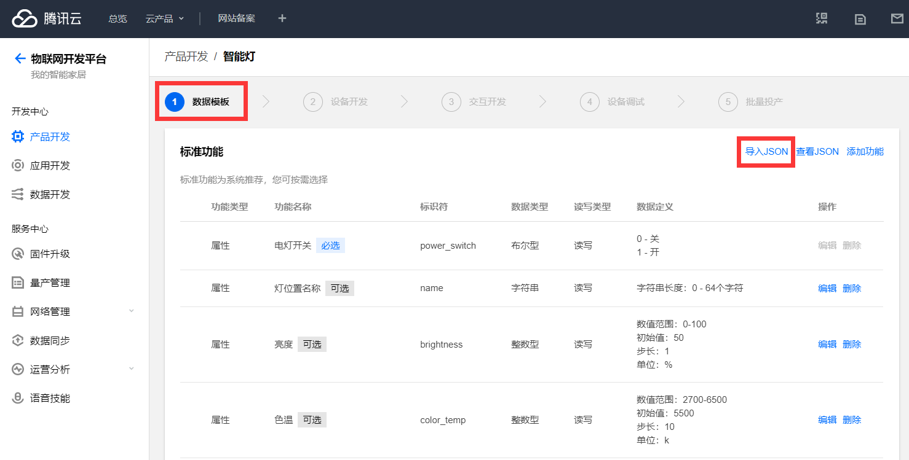  

没有修改json的话可以略过这一步，如果你之前在数据模板中添加了自己的功能或有其他修改，请点击“查看json”然后导出
，将导出的json放在`iot_led\qcloud-iot-sdk-tencent-at-based\tools`，cmd窗口运行`python codegen.py -c 你导出的数据模板.json`，重新生成数据模板代码，如果提示出错，请检查编码是否为GBK，将生成几个c文件放入 `iot_led\qcloud-iot-sdk-tencent-at-based\usr_logic`，打开 `iot_led\qcloud-iot-sdk-tencent-at-based\usr_logic\data_template_usr_logic.c`，在 `static void deal_down_stream_user_logic(void *pClient, ProductDataDefine * pData)` 中开发你自己的功能。  

交互开发，面板配置这里按自己的需求摆放各个组件、设置图标等，你也可以照搬我的设计，其他面板配置请参考官网文档  
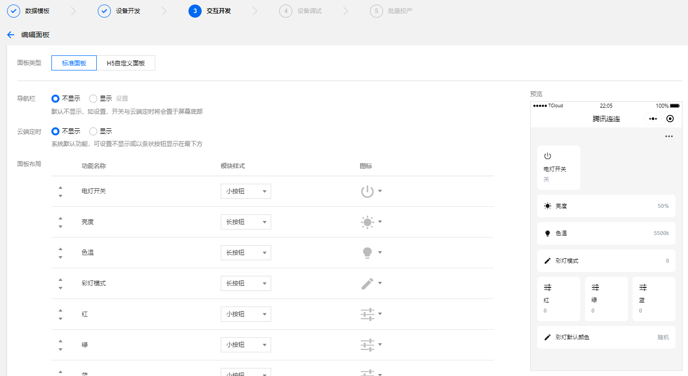

设备调试，设备端代码编译并下载后你可以在这里在线调试  

打开 `iot_led\user_code\user_config.h`
找到你刚刚创建的设备，填入设备密钥、产品ID、设备名  
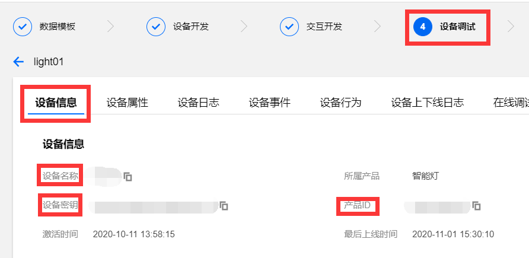  

填入你家的wifi名和密码（如果作为一个真正商用的产品，应该通过配网或其他方式来获取wifi信息，不应该在代码中写wifi名和密码，因为你不可能知道用户家的wifi，目前配网功能有，但还不完善，就先这样用吧）  

打开`TencentOS-tiny\board\TencentOS_tiny_EVB_G0\BSP\Inc\stm32g0xx_hal_conf.h`打开这处宏 
`/* #define HAL_TIM_MODULE_ENABLED   */`  

打开`TencentOS-tiny\board\TencentOS_tiny_EVB_G0\TOS_CONFIG\tos_config.h`
修改`#define TOS_CFG_TASK_DYNAMIC_CREATE_EN  0u`为1
由于启用了动态创建任务，任务栈会从对内存申请，所以系统堆内存适当改大一点，避免溢出`#define TOS_CFG_MMHEAP_DEFAULT_POOL_SIZE        0x2000`  

最好结合自己的代码，在系统完全运行起来以后使用`k_err_t tos_mmheap_check(k_mmheap_info_t *info);`查看内存使用情况，适当修改对内存的大小。如果出现莫名其妙的死机、重启等问题，大概率是内存不足溢出了。  

打开
`TencentOS-tiny\board\TencentOS_tiny_EVB_G0\BSP\Src\stm32g0xx_it_module.c`
添加头文件`#include "hal_at.h"`
添加`extern sRingbuff g_ring_buff;`  
修改
```
void HAL_UART_RxCpltCallback(UART_HandleTypeDef *huart)
{
    /* data is defined in usart.c */
    extern uint8_t data;
    
    if (huart->Instance == USART2) {
        HAL_UART_Receive_IT(&huart2, &data, 1);
        tos_at_uart_input_byte(data);
    }
}
```
如下
```
void HAL_UART_RxCpltCallback(UART_HandleTypeDef *huart)
{
    /* data is defined in usart.c */
    extern uint8_t data;
    
    if (huart->Instance == USART2) {
        HAL_UART_Receive_IT(&huart2, &data, 1);
        // tos_at_uart_input_byte(data);
        ring_buff_push_data(&g_ring_buff, &data, 1);
    }
}
```

编译下载运行

设备菜单选择配网，打开微信，在主页面下拉，搜索“腾讯连连小程序”，点击加号添加设备，在电工照明中选择灯，按照提示进行配网

enjoy it!

具体使用效果请看视频


# Q&A

Q: 为什么不用github而使用gitee？  
A: 以国内的网络状况使用github经常出现“我上传不上去，你下载不下来”的情况，gitee就不存在这个问题，顺便支持一下国产。  

Q: TencentOS的代码太大了，国内网络状况也不咋地，git clone总是失败怎么办？  
A: 使用gitee新建一个仓库，选择导入已有仓库并填入 `https://github.com/Tencent/TencentOS-tiny.git` 待后台同步完成后就可以像github一样使用了，速度飞快。  

Q: E53模块及开发板如何供电？  
A: 使用12V电源接入E53模块即可，TOS_EVB_G0开发板及E53模块自身的5V电源来自E53模块降压，TOS_EVB_G0开发板及E53模块自身的3.3V电源来自TOS_EVB_G0开发板的降压。  

Q: E53模块供电能力如何？  
A: 按目前的设计方案，SY8120B1ABC最大输出电流为2A，如需驱动更多WS2812灯珠，或给其他大功率负载供电请更换其他pin to pin兼容的芯片，并按芯片要求选取合适的外围元件。手头暂时没有合适的电感，图片中使用的是一颗47uH电感，且内阻较大，实测输出电流超过600mA时电感发热严重。  

Q: E53模块驱动LED灯条有哪些注意事项？  
A: 目前设计方案供电电压为12V，最高建议不要超过15V。12V情况下可以驱动的3V、6V、9V的LED灯珠或灯条。由于PT4115是降压型LED驱动芯片，理论化输入电压要高于LED的额定电压，实测起始可以驱动12V的LED灯条，但是效果不太理想，不建议这么使用。单路PT4115最大输出电流为1A，注意LED灯条的功率，并修改合适的采样电阻。  

Q: PT4115的采样电阻如何取值？  
A: 实际采样电阻的取值请根据你的LED灯条额定功率进行计算，E53模块上的PT4115驱动预留两个采样电阻焊盘，你可以采用短路一个焊盘、两个电阻串联、两个电阻叠焊等各种手段组合出各种阻值。阻值与限流关系计算公式为`Iout = 0.1 / RS (RS ≥ 0.082 ohm)`，其中Iout为占空比100%时的输出电流，即最大输出电流，更多内容详见PT4115数据手册。  

Q: 如果采用12V以上的输入电压，有哪些注意事项？  
A: 注意更换更高耐压的电容及芯片，降压芯片SY8120B1ABC的最高输入电压为18V，请更换其他更高耐压的pin to pin兼容芯片，例如SY8291ABC、SY8401ABC、ME3116AM6G、LM2841XBMKX等，更多芯片可以上立创商城选购。  

Q: 线性稳压和开关稳压该如何选择？  
A: 大功率5V负载如驱动10颗以上的WS2812建议使用开关稳压方案，否则请使用线性稳压方案，可使用AMS1117-5.0或HT7150-1等，AMS1117的最高输入电压为18v，HT7150最高输入电压为30V，请根据输入电压选型，线性稳压与开关稳压共用C1、C3电容。  

Q: 为什么亮度设置在2%时灯管不亮？  
A: PT4115的有效占空比范围在4%-100%之间，4%以下会认为关闭，不同批次芯片性能也略有差异，详见PT4115数据手册。  

Q: 为什么设备重启、上电时灯会闪一下？  
A: 这与MCU与LED驱动芯片有关，stm32的GPIO上电默认浮空输出，而PT4115的控制引脚内部带有一个1.2M的上拉电阻，在stm32的GPIO还没有初始化并拉低时会点亮LED灯。解决方法：可以在预留的焊盘上焊接一个合适的下拉电阻，本方案中这个电阻取值，大约在50K-100K左右，注意电阻的取值不能过小，以免MCU的GPIO驱动能力不足导致无法拉高而点不亮LED灯。  

Q: 如果我使用12V供电想要驱动18V或更高电压的LED灯管该怎么办？  
A: 目前的方案为降压型LED驱动，不支持升压，如有需要可采用SY7200AABC等升压型LED，电路图及PCB请自行修改，暂时没有成品设计方案。  

Q: 这么多的灯光效果是如何实现的？  
A: 基于github开源项目 [WS2812FX](https://github.com/kitesurfer1404/WS2812FX) ，适配arduino接口，将源代码cpp修改并适配为c语言，比较简单粗暴，参见 [WS2812FX_C_Lang](https://gitee.com/dma/ws2812fx_c_lang)  

Q: 这个模块可以用在TencentOS_tiny_EVB_LX、TencentOS_tiny_EVB_MX_Plus等开发板上吗？  
A: 目前只保证在TencentOS_tiny_EVB_G0上工作正常，其他开发板可能需要移植部分代码，注意修改管脚PWM输出、WS2812驱动时序等，部分开发板对应E53接口的GPIO4及GPIO5可能无法输出硬件PWM，可以考虑软件PWM或者从可以输出PWM的引脚飞线。  

Q: 哪里可以获得TencentOS_tiny_EVB_G0开发板呢？  
A: 我也不知道呀，我这块板子是活动得到的，在国内某著名电商网站搜“物联网俱乐部”，这家店可能有的卖。如果没有的话要不你自己照着原理图画一个？  

Q: 路由器器重启后设备就掉线了，有什么解决办法？  
A: 官方ESP8266定制固件暂不支持wifi掉线自动重连，只能重启设备等待自动重连，如果你知道wifi密码的话，也可以在代码中调用`AT+CWJAP`命令进行重连。  

Q: 打算出成品吗？或者做小批量？  
A: 个人精力有限，不论是E53模块还是整套台灯都不打算出成品或小批量，所有设计方案全部开源，有兴趣可以自己制作，觉得我的方案用着不爽欢迎自己改造，不想动手做的可以直接买品牌智能台灯。手头剩余的几块PCB可能会送给朋友及同事。  

Q: 为什么开源发布的原理图和PCB与你文章中展示的不一样？  
A: 部分与SY8120B1ABC pin to pin兼容的芯片需要续流二极管，而SY8120B1ABC不需要，因此在原理图及PCB中添加了这个二极管，不影响使用。  

Q: 能提供技术支持吗？  
A: 个人精力有限，随缘吧！  

Q: 这个方案能商用吗？  
A: 请遵守开源协议。  
