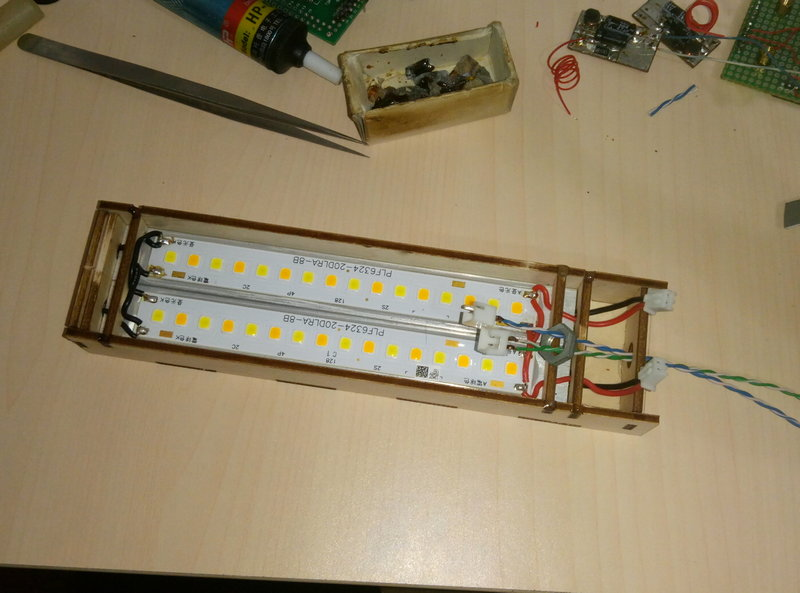

# 1 项目简介

## 1.1 项目介绍
台灯是日常使用频率最高的电器，将给大家介绍如何制作一款可以使用微信小程序进行远程控制的智能台灯。这款台灯操作简便，可以灵活调节亮度、色温，开发板上的OLED显示屏能够实时显示台灯的状态，同时预留了WS2812灯带接口，内置多种彩灯模式，可以做氛围灯使用。所有软硬件设计全部开源，动手能力强的小伙伴也可以在此基础上改造属于你自己的智能台灯。相关问题解答参见文末Q&A章节。

## 1.2 材料清单
TencentOS_tiny_EVB_G0 开发板 x1
E53接口LED驱动模块 x1 （需要自己焊接，详细物料清单参见下方链接）
椴木板外壳一套 （需要根据图纸自己加工）
双色温LED灯管 x2 （文中同款搜索“Rohm led灯条”）
150 * 20 * 6 mm 散热器 x2
12V 1A 电源 x1 （保护环境，可以使用旧路由器、电视盒子等的电源，输出电压12V，输出电流为1A或更高）
鹅颈管 x1
鹅颈管配套铁夹 x1
鹅颈管配套螺母若干
UHU胶、电线、焊锡、电烙铁、镊子、扳手等其他材料与工具

## 1.3 项目链接
视频演示  
https://www.bilibili.com/video/bv1BK411G7cn  

工程源码  
https://gitee.com/dma/iot_led.git  

电路图及PCB  
https://oshwhub.com/Code504/e53-kuo-zhan-mu-kuai_copy  


# 2 硬件制作

## 2.1 TOS_EVB_G0 开发板
TOS_EVB_G0 开发板是由腾讯TencentOS-tiny团队设计的一款物联网开发板，外观如下：  
  

* 主控芯片采用STM32G070RB，Flash空间为128KB、RAM空间为36KB；
* 板载腾讯云定制固件版ESP8266 WIFI模组；
* 板载E53传感器标准接口，方便连接各种E53传感器；
* 板载128*32 OLED显示屏幕；
* 板载8MB SPI Flash，可用于固件升级；
* 板载CH340转串口连接，可以使用一根USB线连接至电脑，查看串口日志；

下面是每部分详细的说明：  

开发板硬件电路详解  
(1) 最小系统电路  
最小系统部分由电源电路、时钟电路、Boot电路、复位电路、下载电路组成：  
  

(2) WIFI电路  
WIFI部分包括ESP8266 WIFI模组供电电路、串口通信电路：  
  

(3) E53扩展接口电路  
E53扩展接口供外部传感器连接，包括：一个串口、一个SPI接口、一个IIC接口、四个普通GPIO口、一个ADC模拟采集接口，一个DAC模拟输出接口，如图：  
  

(4) USB转串口电路  
USB转串口电路将串口信息转换为USB口信号，使得开发板可以直接通过USB线连接至PC，在PC上使用串口助手查看日志：  
  

(5) OLED显示屏幕电路  
OLED屏幕部分包括OLED供电部分和通信部分：  
  

(6) 连接Micor USB线  
  

(7) 连接ST-Link下载器  
开发板3v3---> STlink 3.3V  
开发板DIO---> STlink SWDIO  
开发板CLK---> STlink SWCLK  
开发板GND---> STlink GND  
请大家参考下图进行连接，千万不要接反接错，以免烧掉MCU  
  

## 2.2 台灯外壳及结构
首先需要购买鹅颈管、铁架、螺母等零件，规格如下:

鹅颈管建议选用40-60cm长，空心偏硬的鹅颈管，注意鹅颈管的内径不要太小，否则电线难以穿过，一定要选硬质鹅颈管，确保能够承受灯管的重量，两端螺纹规格分别为M10细牙扁头、M8细牙圆头，扁透这一端主要用于和夹子连接，圆头用于和灯管外壳连接，方便调整灯管角度，如果买不到同规格的尽量买参数相近的鹅颈管。  
  

铁夹子选购时注意开孔的形状，最好使用扁孔，这样方便固定鹅颈管，保证不会旋转，买不到扁孔和夹子和鹅颈管用圆孔的也行，记得把螺母稍微拧紧些  
  

当然还要记得买配套的螺母，有的店家会送  
  

灯管用704硅橡胶居中粘在散热器上，胶水一定不要挤得太多，胶水干透后焊接双色LED灯管（同款搜索“Rohm led灯条”），每个灯管的黄色与黄色并联，白色与白色并联  
  

下一步准备台灯外壳，图纸在源码的 doc 文件夹内，店家一般都是在一整块木板上进行切割，不论实际切割的大小都按整张板收费（不同店家收费可能不同，请自己与店家沟通），因此建议在一张图纸内多切割几个外壳，充分利用这块木板，减少浪费。如下图所示，这里在一块木板上切了4套台灯外壳和其他几个外壳  
  

实测单灯管照明有点暗，强烈建议用两个灯管，下图中标注的单灯管零件就不要使用了，B1和B2、G1和G2、H1和H2完全一样，F1和F2的区别在于开孔的直径不一样，一个是8mm，另一个是10mm，如果买不到同规格的鹅颈管方便替换使用
  

将H1、H2粘在A上，这一步的主要目的是增加外壳的整体厚度，确保F1和F2开孔处有一定的轻度，否则开孔与边框离得太近很容易断
  

将F1或F2按图纸箭头所示插入A对应孔内，B1和B2分别竖着安装在A的两侧，同时将F1或F2插入孔内，将C与D对齐粘在一起，将C按箭头所示进行组装  
  

等前几步的胶水干透以后，将灯管放入外壳，并将电线从E预留的孔中穿过，最后将E按照箭头所示进行安装  
  

最后将G1、G2按箭头所示进行安装，电线同样需要从预留的凹槽中穿过
  

在组装之前建议先按下图所示摆放一遍，确保没有拿错零件，最后再进行完整组装
  

最后组装完成是这样的，供大家参考，安装时一定注意先后顺序，提前把线、螺母穿好，避免返工  
  

上图有一个细节，我的外壳边缘比中间的零件大概高出2mm，预留用于安装透明外壳。如果买了什么东西的包装盒是塑料磨砂材质，可以裁剪一块合适大小盖在灯管外壳上，这样光线会柔和一点，不至于太刺眼。实在没有可以不装，如果不差钱也可以按尺寸找商家切割一块2mm厚的雾面亚克力。

**注意事项**
不同商家的木板厚度有一定误差，切割机也有一定误差，请提前沟通，误差一般在0.1-0.2mm左右，可能需要在图纸中进行补偿

## 2.3 E53接口LED驱动模块
请根据原理图内物料清单采购元件并焊接，模块焊接完成如图  
  
  

请按下图所示与开发板进行组装
  

**注意事项**
1. 板子上预留WS2812灯带的接口，没有灯带或不需要灯带可以不焊。  
2. 不使用灯带或WS2812灯珠数量少于5个，建议采用线性稳压方案；超过5个建议采用开关稳压方案。  
3. 板子上有两路PT4115驱动，如果使用双色灯管，左边一路接黄色，右边一路接白色。如果使用单色灯管，建议只接右边一路，并把色温调整到6500K，这样使用的缺点就是浪费了一路驱动，想要驱动两路白光LED，请自行修改的代码，删除调整色温的相关内容。  
4. 灯管的功率计额定电压决定了PT4115的采样电阻，目前用的是两根双色温灯管，单根灯管额定电压6V，单色额定电流300mA，这里是两根灯管的黄色与黄色并联、白色与白色并联，单色温的总额定电流为600mA，根据PT4115手册计算出0.2ohm采样电阻输出电流为500mA，因此串联两个0.1ohm的采样电阻。如果使用其他规格的灯管请自行计算采样电阻阻值。  
5. 旋转编码器旁边有一个排阻，为IO口上拉，如果单片机支持上拉可以不焊。  
6. P2、P3、R3、R4为预留测试焊盘，不需要焊接。  
7. 设计输入电压为12V，如需驱动更高电压、更大功率的LED灯管，请注意元件耐压，可能需要更换更高耐压的元件。  


# 3 软件开发

## 3.1 ESP8266烧写腾讯云定制固件

### 3.1.1 下载固件
腾讯云IoT AT指令是一套针对使用通讯模组（2G/4G/NB/WIFI）接入腾讯云物联平台的定制AT指令集，如果通讯模组实现了该指令集，则设备接入和通讯更为简单，所需代码量更少。 ESP8266作为IoT领域使用最广泛的一款WiFi芯片/模组，腾讯云在其通用AT指令基础上，增加了腾讯云IoT AT指令集，形成一个定制的模组固件QCloud_IoT_AT_ESP8266。  
下载链接：https://github.com/tencentyun/qcloud-iot-esp-wifi  
使用git下载的命令如下：  
`git clone https://github.com/tencentyun/qcloud-iot-esp-wifi.git`
下载之后即可在图中圈出的文件夹中看到定制固件：  
  

### 3.1.2 下载烧写工具
使用乐鑫官方下载工具ESPFlashDownloadTool，下载链接如下：  
https://www.espressif.com/zh-hans/support/download/other-tools  
点击下载Flash 下载工具（ESP8266 & ESP32 & ESP32-S2）：  
  
下载之后解压即可。  

### 3.1.3 固件说明
腾讯云IoT定制的AT模组固件QCloud_IoT_AT_ESP8266，适用于所有FLASH大小为2MB或者2MB以上的ESP8266模组。  
AT串口使用UART0，默认的Tx为GPIO1，Rx为GPIO3。但因为ESP8266的UART0 默认会在上电启动期间输出一些打印，如果打印信息影响设备功能，可在上电期间将 U0TXD(GPIO1)、U0RXD(GPIO3) 分别与 U0RTS (GPIO15)，U0CTS(GPIO13)进行交换，以屏蔽打印。因此提供两个版本的固件：  
* 名称包含UART_1_3的固件串口使用的Tx为GPIO1，Rx为GPIO3。  
* 名称包含UART_15_13的固件串口使用的Tx为GPIO15，Rx为GPIO13。  
进入QCloud_IoT_AT_ESP8266_FW，本文中我们使用第一个固件：  
  

### 3.1.4 烧写固件
切换boot选择端子和串口选择端子  
(1)将开发板上的ESP8266启动引脚配置端子切换到低电平；  
(2)将开发板上的串口选择端子置于中间，使ESP8266直接与PC串口连接：  
方法参考下图：  
  
 
运行Flash烧写工具  
双击工具，运行：  
  

选择开发者模式：  
  

选择ESP8266下载工具：  
  

开始下载  
按照图中进行操作：  
  

点击下载之后，按下开发板上的复位键，Flash下载工具开始下载：  
  

若没有显示，请检查接线端子是否连接正确。  

下载完成  
下载完成之后如图：  
  

关闭工具，将boot选择引脚拔下，将串口选择端子恢复默认。  

注意：完成固件下载后，一定切记将跳线端子恢复到默认状态，默认端子怎么短接可以参考前面完整的组装成品图，否则wifi将没法工作，MCU也没法控制wifi。  

## 3.2 工程代码修改与使用
下载TencentOS代码 https://github.com/Tencent/TencentOS-tiny.git  

下载本工程代码 https://gitee.com/dma/iot_led.git  

把本工程代码放在 `TencentOS-tiny\board\TencentOS_tiny_EVB_G0\KEIL`下  

本工程使用的是AT SDK，已经集成在工程下，因为部分功能的需要，我在官方SDK的基础上做了一些修改及适配，源码在这里 https://github.com/tencentyun/qcloud-iot-sdk-tencent-at-based  

如需移植其他OS或开发板请参阅官方文档自行修改。  

在腾讯物联网开发平台创建设备，具体步骤参见 https://cloud.tencent.com/document/product/1081/34738  

产品定义，新建项目，新建产品，按如下配置  
  

数据模板，选择“导入json”，json文件路径 `iot_led\user_code\智能灯.json`，你也可以添加自己的功能，或在此基础上进行二次开发  
  

没有修改json的话可以略过这一步，如果你之前在数据模板中添加了自己的功能或有其他修改，请点击“查看json”然后导出
，将导出的json放在`iot_led\qcloud-iot-sdk-tencent-at-based\tools`，cmd窗口运行`python codegen.py -c 你导出的数据模板.json`，重新生成数据模板代码，如果提示出错，请检查编码是否为GBK，将生成几个c文件放入 `iot_led\qcloud-iot-sdk-tencent-at-based\usr_logic`，打开 `iot_led\qcloud-iot-sdk-tencent-at-based\usr_logic\data_template_usr_logic.c`，在 `static void deal_down_stream_user_logic(void *pClient, ProductDataDefine * pData)` 中开发你自己的功能。  

交互开发，面板配置这里按自己的需求摆放各个组件、设置图标等，点击左边的箭头可以设置图标顺序，样式和图标可以按自己的喜好进行更改，也可以照搬这个设计  
  

设备调试，设备端代码编译并下载后你可以在这里在线调试  

打开 `iot_led\user_code\user_config.h`
找到你刚刚创建的设备，填入设备密钥、产品ID、设备名  
  

填入你家的wifi名和密码（如果作为一个真正商用的产品，应该通过配网或其他方式来获取wifi信息，不应该在代码中写wifi名和密码，因为你不可能知道用户家的wifi，目前配网功能有，但还不完善，就先这样用吧）  

打开`TencentOS-tiny\board\TencentOS_tiny_EVB_G0\BSP\Inc\stm32g0xx_hal_conf.h`打开这处宏 
`/* #define HAL_TIM_MODULE_ENABLED   */`  

打开`TencentOS-tiny\board\TencentOS_tiny_EVB_G0\TOS_CONFIG\tos_config.h`
修改`#define TOS_CFG_TASK_DYNAMIC_CREATE_EN  0u`为``#define TOS_CFG_TASK_DYNAMIC_CREATE_EN  0u``
由于启用了动态创建任务，任务栈会从对内存申请，所以系统堆内存适当改大一点，避免溢出`#define TOS_CFG_MMHEAP_DEFAULT_POOL_SIZE        0x2000`  

最好结合自己的代码，在系统完全运行起来以后使用`k_err_t tos_mmheap_check(k_mmheap_info_t *info);`查看内存使用情况，适当修改对内存的大小。如果出现莫名其妙的死机、重启等问题，大概率是内存不足溢出了。  

打开
`TencentOS-tiny\board\TencentOS_tiny_EVB_G0\BSP\Src\stm32g0xx_it_module.c`
添加头文件`#include "hal_at.h"`
添加`extern sRingbuff g_ring_buff;`  
修改
```
void HAL_UART_RxCpltCallback(UART_HandleTypeDef *huart)
{
    /* data is defined in usart.c */
    extern uint8_t data;
    
    if (huart->Instance == USART2) {
        HAL_UART_Receive_IT(&huart2, &data, 1);
        tos_at_uart_input_byte(data);
    }
}
```
如下
```
void HAL_UART_RxCpltCallback(UART_HandleTypeDef *huart)
{
    /* data is defined in usart.c */
    extern uint8_t data;
    
    if (huart->Instance == USART2) {
        HAL_UART_Receive_IT(&huart2, &data, 1);
        // tos_at_uart_input_byte(data);
        ring_buff_push_data(&g_ring_buff, &data, 1);
    }
}
```

编译下载运行  

# 4 使用演示
设备菜单选择配网，打开微信，在主页面下拉，搜索“腾讯连连小程序”，点击加号添加设备，在电工照明中选择灯，按照提示进行配网。详细操作步骤请看视频演示  
https://www.bilibili.com/video/bv1BK411G7cn  


# 5 Q&A
Q: 为什么不用github而使用gitee？  
A: 以国内的网络状况使用github经常出现“我上传不上去，你下载不下来”的情况，gitee就不存在这个问题，顺便支持一下国产。  

Q: TencentOS的代码太大了，国内网络状况也不咋地，git clone总是失败怎么办？  
A: 使用gitee新建一个仓库，选择导入已有仓库并填入 `https://github.com/Tencent/TencentOS-tiny.git` 待后台同步完成后就可以像github一样使用了，速度飞快。  

Q: E53模块及开发板如何供电？  
A: 使用12V电源接入E53模块即可，TOS_EVB_G0开发板及E53模块自身的5V电源来自E53模块降压，TOS_EVB_G0开发板及E53模块自身的3.3V电源来自TOS_EVB_G0开发板的降压。  

Q: E53模块供电能力如何？  
A: 按目前的设计方案，SY8120B1ABC最大输出电流为2A，如需驱动更多WS2812灯珠，或给其他大功率负载供电请更换其他pin to pin兼容的芯片，并按芯片要求选取合适的外围元件。手头暂时没有合适的电感，图片中使用的是一颗47uH电感，且内阻较大，实测输出电流超过600mA时电感发热严重。  

Q: E53模块驱动LED灯条有哪些注意事项？  
A: 目前设计方案供电电压为12V，最高建议不要超过15V。12V情况下可以驱动的3V、6V、9V的LED灯珠或灯条。由于PT4115是降压型LED驱动芯片，理论化输入电压要高于LED的额定电压，实测起始可以驱动12V的LED灯条，但是效果不太理想，不建议这么使用。单路PT4115最大输出电流为1A，注意LED灯条的功率，并修改合适的采样电阻。  

Q: PT4115的采样电阻如何取值？  
A: 实际采样电阻的取值请根据你的LED灯条额定功率进行计算，E53模块上的PT4115驱动预留两个采样电阻焊盘，你可以采用短路一个焊盘、两个电阻串联、两个电阻叠焊等各种手段组合出各种阻值。阻值与限流关系计算公式为`Iout = 0.1 / RS (RS ≥ 0.082 ohm)`，其中Iout为占空比100%时的输出电流，即最大输出电流，更多内容详见PT4115数据手册。  

Q: 如果采用12V以上的输入电压，有哪些注意事项？  
A: 注意更换更高耐压的电容及芯片，降压芯片SY8120B1ABC的最高输入电压为18V，请更换其他更高耐压的pin to pin兼容芯片，例如SY8291ABC、SY8401ABC、ME3116AM6G、LM2841XBMKX等，更多芯片可以上立创商城选购。  

Q: 线性稳压和开关稳压该如何选择？  
A: 大功率5V负载如驱动5颗以上的WS2812建议使用开关稳压方案，否则请使用线性稳压方案，可使用AMS1117-5.0或HT7150-1等，AMS1117的最高输入电压为18v，HT7150最高输入电压为30V，请根据输入电压选型，线性稳压与开关稳压共用C1、C3电容。  

Q: 为什么亮度设置在2%时灯管不亮？  
A: PT4115的有效占空比范围在4%-100%之间，4%以下会认为关闭，不同批次芯片性能也略有差异，详见PT4115数据手册。  

Q: 如果我使用12V供电想要驱动18V或更高电压的LED灯管该怎么办？  
A: 目前的方案为降压型LED驱动，不支持升压，如有需要可采用SY7200AABC等升压型LED，电路图及PCB请自行修改，暂时没有成品设计方案。  

Q: 这么多的灯光效果是如何实现的？  
A: 基于github开源项目 [WS2812FX](https://github.com/kitesurfer1404/WS2812FX) ，适配arduino接口，将源代码cpp修改并适配为c语言，比较简单粗暴，参见 [WS2812FX_C_Lang](https://gitee.com/dma/ws2812fx_c_lang)  

Q: 这个模块可以用在TencentOS_tiny_EVB_LX、TencentOS_tiny_EVB_MX_Plus等开发板上吗？  
A: 目前只保证在TencentOS_tiny_EVB_G0上工作正常，其他开发板可能需要移植部分代码，注意修改管脚PWM输出、WS2812驱动时序等，部分开发板对应E53接口的GPIO4及GPIO5可能无法输出硬件PWM，可以考虑软件PWM或者从可以输出PWM的引脚飞线。  

Q: 哪里可以获得TencentOS_tiny_EVB_G0开发板呢？  
A: 我也不知道呀，我这块板子是活动得到的，在国内某著名电商网站搜“物联网俱乐部”，这家店可能有的卖。如果没有的话要不你自己照着原理图画一个？  

Q: 路由器器重启后设备就掉线了，有什么解决办法？  
A: 官方ESP8266定制固件暂不支持wifi掉线自动重连，只能重启设备等待自动重连，如果你知道wifi密码的话，也可以在代码中调用`AT+CWJAP`命令进行重连。  

Q: 打算出成品吗？或者做小批量？  
A: 个人精力有限，不论是E53模块还是整套台灯都不打算出成品或小批量，所有设计方案全部开源，有兴趣可以自己制作，觉得我的方案用着不爽欢迎自己改造，不想动手做的可以直接买品牌智能台灯。手头剩余的几块PCB可能会送给朋友及同事。  

Q: 为什么开源发布的原理图和PCB与你文章中展示的不一样？  
A: 部分与SY8120B1ABC pin to pin兼容的芯片需要续流二极管，而SY8120B1ABC不需要，因此在原理图及PCB中添加了这个二极管，不影响使用。  

Q: 为什么设备重启、上电时灯会闪一下？  
A: 这与MCU与LED驱动芯片有关，stm32的GPIO上电默认浮空输出，而PT4115的控制引脚内部带有一个1.2M的上拉电阻，在stm32的GPIO还没有初始化并拉低时会点亮LED灯。解决方法：可以在预留的焊盘上焊接一个合适的下拉电阻，本方案中这个电阻取值，大约在50K-100K左右，注意电阻的取值不能过小，以免MCU的GPIO驱动能力不足导致无法拉高而点不亮LED灯  

Q: 能提供技术支持吗？  
A: 个人精力有限，随缘吧！  

Q: 这个方案能商用吗？  
A: 请遵守开源协议。  
